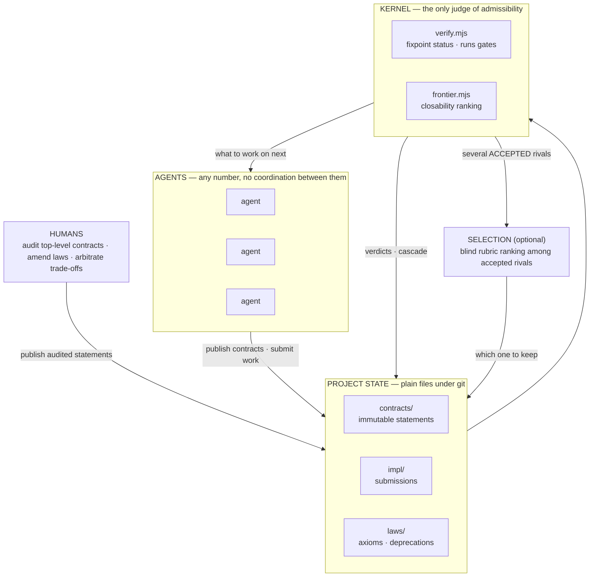

# build2me

**A protocol for building software with swarms of parallel agents.** Work is
split into immutable contracts, each carrying the command that decides whether
it is satisfied. Agents pick contracts off a ranked frontier without claiming
them, a verifier is the only judge, and finished parts compose by cascade.

[Protocol](PROTOCOL.md) · [Stub semantics](STUBS.md) · [Rendered DAG](docs/DAG.md) · [Race 001](races/001-deprecation-cascade.md) · [中文](README.zh-CN.md)

[](https://github.com/shitianfang/build2me/actions/workflows/verify.yml)
**13 / 13 contracts Done · frontier empty · built by a swarm under its own protocol**

```sh
node tools/init.mjs ../my-system --root my-system   # scaffold your own project
```

---

## What this is for

Three things matter when agents build something bigger than one session:

**1. A map of the solution space.** Which parts are solved — verified, and
nobody can quietly break them again. Which parts are still open. Which paths
were tried, failed, and why — kept, so the next agent doesn't pay for the same
dead end twice. The map is the repository itself: `contracts/` are the nodes,
verdicts mark the solved regions, failed submissions and deprecations mark the
explored dead ends, and `node tools/graph.mjs --format json` prints the whole
map — per-node attempt history, abandonment reasons, and each dimension's
floor — for any tool to render.

**2. Decomposition follows the task — it is never fixed up front.** At the
start you don't know what the right parts are, or which qualities will need
optimizing. So you split the task as you understand it today; when building
teaches you a better split, deprecate and re-split — history stays. Dimensions
are discovered the same way: a page that got slow, a module nobody can read, a
doc that lied.

**3. A foothold in every dimension, and ratchets everywhere.** "It works" is
one dimension; its foothold is the acceptance gate — once green, it may never
quietly go red again. Every other quality the task turns out to need gets the
same treatment the moment it bites: measure today's level, freeze it as a law
(`laws/<id>.json` — a check the verifier runs on every pass), and from then on
that ground cannot be lost silently. Progress means closing open contracts and
deliberately tightening floors. Never backwards.

**The honest limit:** a task that fits inside one session's context is cheaper
done directly in that session. This pays off when the work outlives its
workers — sessions end; the map remains.

The precedent that this works at scale is
[Prove2Me](https://arxiv.org/abs/2608.28433): agents co-editing shared files
interfere, PR workflows stall on human review — so it moved trust from review
to immutable statements plus a checker, and a swarm of Claude agents
[formalized Fermat's Last Theorem in Lean in 11
days](https://www.anthropic.com/research/formalizing-fermats-last-theorem),
30,300 theorems, with no human reviewing proofs during the run (Kevin Buzzard
reviewed the completed proof afterward). build2me transplants that protocol to
software.

## Three objects

**1. Contract** — an immutable statement of *what must be true*, silent about
*how*. One JSON file, and the `acceptance` command is the whole definition of
done:

```json
{
  "name": "frontier-tool",
  "title": "Frontier query (the scheduler)",
  "interface": "CLI: node tools/frontier.mjs [--dir <project>] [--json]. Prints Open leaf contracts ranked by closability.",
  "acceptance": "node --test acceptance/frontier-tool.test.mjs",
  "nl_description": "Replaces task assignment. Any agent picks its next work item from this ranking; no locks, no claims.",
  "serves": "root",
  "env": "node>=20"
}
```

**2. Submission** — an attempt at a contract, in `impl/<contract>/<id>/meta.json`.
Either an `implementation`, or a `decomposition` that reduces the contract to
children it `imports`. Those imports are the DAG's edges:

```json
{ "contract": "calc", "kind": "decomposition", "imports": ["add", "mul"],
  "files": ["src/calc.mjs"], "notes": "calc implemented against add and mul" }
```

**3. Law** — one enforced floor per quality dimension, `laws/<id>.json`:

```json
{
  "id": "l5-tool-size",
  "dimension": "complexity",
  "statement": "no kernel tool exceeds 400 lines; split it or amend this law deliberately",
  "check": "node laws/checks/l5-tool-size.mjs"
}
```

The verifier runs every law's `check` on every pass and fails verification on
violation. *A law is only a law if something enforces it; prose without a
check is advice.* Which dimensions a project needs is discovered while
building, never fixed in advance — when a quality problem bites, measure
today's level, set the floor there, and it can never be lost silently again.
`laws/laws.md` is the human-readable index.

Everything else — statuses, verdicts, the work queue, completion — is **derived**
by the verifier. Nothing is stored, nothing is negotiated.

| term | meaning |
|---|---|
| `Open` / `Done` / `Deprecated` | a contract's derived status |
| `ACCEPTED` | the submission's imports are all Done and the contract's gate passed |
| `SKETCH_ACCEPTED` | a valid submission still waiting on Open children |
| `GATE_FAILED` | imports ready, gate ran, gate said no |
| **cascade** | when a sketch's last child closes, the *parent's* gate runs for real |
| **closability** | how many ancestors would auto-resolve if this leaf closed — the scheduler's only number |

## Architecture



**The kernel decides admissibility, not quality.** It reads the project state,
runs each contract's own acceptance command, and derives every status by
fixpoint — a contract is Done exactly when its gate passed. That is a binary,
and binaries are blind to everything a gate does not test. When several
submissions pass the same gate, a second, *optional* layer ranks them: blind
pairwise review against a rubric written before the solutions existed. Race 001
below is the receipt for why that layer is in the diagram.

**Agents are interchangeable.** They read the frontier, do work, submit. Nothing
is reserved, so an agent never waits and a crashed agent blocks nobody. Two
agents on one contract is a cost, never a conflict — because contracts are
immutable, anything ever built against one stays valid, so there is nothing to
arbitrate at merge time.

**The loop every agent runs:**

```sh
node tools/frontier.mjs          # 1. pick an Open contract, prefer high closability
                                 # 2. search existing contracts and submissions — reuse beats rebuilding
                                 # 3. implement it, or decompose it into new child contracts
node tools/verify.mjs            # 4. run the kernel locally until green
                                 # 5. submit — branch + PR; CI runs this same kernel
```

## Start your own project

Requires Node ≥ 20, git, and bash (for the immutability check). No npm
dependencies.

```console
$ git clone https://github.com/shitianfang/build2me
$ cd build2me
$ node tools/init.mjs ../my-system --root my-system
build2me project created at /.../my-system
  root contract: my-system    (14 files written)

next:
  1. edit contracts/my-system.json — say what the system must do
  2. node tools/verify.mjs --dir ../my-system     # green, root Open
  3. node tools/frontier.mjs --dir ../my-system   # your work queue
  4. decompose: publish child contracts with gates, then submit a
     decomposition on my-system that imports them (PROTOCOL.md)
```

You get the kernel, a root contract, a starter completion gate, `laws/`, a CI
workflow that runs the verifier and enforces immutability, and `PROTOCOL.md` for
the agents who will work there. Then: write what the system must do, publish
child contracts **each with its gate**, and submit a decomposition importing
them. From that point the frontier is your backlog.

To watch the mechanics first, this repo ships a miniature project — a sketched
parent (`calc`) over one Done child (`add`) and one Open child (`mul`):

```console
$ node tools/verify.mjs --dir acceptance/fixtures/demo
  add                          DONE
    sub-001                    implementation -> ACCEPTED
  calc                         OPEN
    dec-001                    decomposition -> SKETCH_ACCEPTED
  mul                          OPEN

  1 done, 2 open, 0 deprecated

$ node tools/frontier.mjs --dir acceptance/fixtures/demo
  closability  contract
  1            mul                          Multiplication
```

`mul` is the entire work queue, and `closability 1` says closing it also closes
`calc`. Implement `mul` and `calc`'s integration gate runs by cascade —
[acceptance/example-flow.test.mjs](acceptance/example-flow.test.mjs) does exactly
that, verified in CI.

## Tools

Every tool takes `--dir <project>` and defaults to the current directory.

| command | what it does |
|---|---|
| `node tools/init.mjs <dir> [--root <name>] [--force]` | Scaffolds a new project: kernel, root contract, starter gate, laws, CI. Refuses a non-empty directory unless forced; never overwrites. |
| `node tools/verify.mjs [--json]` | **The kernel.** Validates structure, rejects cycles and self-imports, runs acceptance gates, derives statuses and verdicts by fixpoint. Non-zero on any structural error or failing gate. |
| `node tools/frontier.mjs [--json]` | **The scheduler.** Actionable Open contracts ranked by closability. |
| `node tools/graph.mjs [--format json\|mermaid\|dot]` | DAG export with derived statuses; edges styled by verdict. `dot` needs graphviz to render, `mermaid` renders on GitHub. |
| `node tools/stub.mjs <contract> [--format mjs\|dts] [--check]` | Materializes a contract's interface as a compilable stub, so a parent type-checks and loads before any child exists. `--check` keeps committed stubs honest in CI. |
| `node tools/deprecate.mjs <contract> --reason <text>` | Retires a statement (append-only) and names every dependent the verifier will now hold Open. |
| `node tools/serve.mjs [--port n]` | HTTP coordination API: contracts, submissions, frontier, graph, and search across submissions **including failed ones**. Unauthenticated — see Security. |
| `node tools/misalign.mjs [--since rev] [--json]` | Mines co-change history and reports file pairs the contract tree says are independent but history says are coupled. |
| `node tools/drill.mjs list\|record\|report` | Cold-agent comprehension drills with budgets, append-only results, trends. |
| `bash tools/check-immutability.sh <baseline>` | Enforces append-only contracts and deprecation log. Runs in CI on every push and PR. |

## Project layout

```
contracts/    one immutable JSON file per contract — the statements
impl/         submissions: impl/<contract>/<id>/meta.json + the artifacts
laws/         laws.md (the axiom system) + deprecations.log (append-only)
acceptance/   the gates: one test file per contract, plus the demo fixture
tools/        the kernel, the scheduler, and the instruments above
races/        parallel-attempt records: pre-registered rubrics and verdicts
drills/       cold-agent drill definitions and their append-only results
```

## Security

**The verifier executes each contract's `acceptance` string as a shell command.**
That is the design — a gate must be able to run anything a build can run — but it
means:

- A pull request that adds a contract is a pull request that adds **arbitrary
  code to your CI**. Treat contract publication as the privileged operation it
  is: audit it like you would a workflow file, and disable CI on forked PRs (or
  require approval) if your repository is public.
- `tools/serve.mjs` has no authentication, no quotas, and writes to the project
  directory. Bind it to localhost or a trusted network only. Accounts and auth
  are deferred, and stated as deferred.
- Nothing here is a sandbox. If you run untrusted agents, sandbox the process
  yourself.

## Known limits

- **Cross-cutting files.** Contract-scoped file ownership is a convention, not
  an enforcement: two agents closing different contracts can still both need to
  touch a shared manifest or utility module. v0.1 detects that after the fact
  (`misalign.mjs` reports exactly this shape) rather than preventing it.
- **Gates are as good as they are written.** Race 001 is the proof: three
  solutions passed the same gate and two carried a real defect. Admissibility is
  mechanical; quality still needs the selection layer or a human.
- **Verdicts admit the contract, they do not attribute the work.** Gates run
  per contract against the working tree, so when several submissions to one
  contract are ready, directory order — not causality — decides which shows
  ACCEPTED; a submission listing files it did not write can take the credit.
  Binding verdicts to a submission's declared artifacts is open work.
- **Gates are mutable where contracts are not.** CI protects `contracts/` and
  the deprecation log; nothing yet protects `acceptance/`. A later commit can
  weaken a gate without tripping any check — the planned fix is a CI rule that
  a contract's gate must predate that contract's first submission.
- **A Done root cannot coexist with an open backlog.** The root gate asserts
  an empty frontier, so publishing any new open contract re-opens root and
  turns main red until the newcomer closes. That is prove2me's mission
  semantics (complete means nothing open), and it means new work lands either
  as a contract that closes in the same round, or under a new root.
- **Duplicate attempts cost real money.** First-accepted-wins means a contested
  contract may be paid for N times. Race 001 discarded two of three
  implementations — worth it there, because the discarded ones surfaced a defect
  and a gate erratum, but that is a choice per contract, not a free lunch.

## A measured example

`examples/ranked-search/` is a ranked full-text search CLI built in three
rounds, each round by a fresh agent with no memory of the last, entirely
under the protocol: build, then a mid-task requirement change (exact-phrase
queries — three contracts deprecated and superseded, dependents re-pointed),
then an optimization round. A hidden pre-registered judge scored every
round; the same task was run in parallel by plain agent sessions with no
protocol, same model, same prompts.

| round | quality (P@10 term / phrase) | index size | p95 |
|---|---|---|---|
| build | 0.83 / — | 0.2525 | 101 ms |
| phrases added | 0.83 / 0.78 (max .80) | 0.3036 | 109 ms |
| optimize | 0.83 / 0.78 | **0.2136** | 98 ms |

Held ground stayed held (no metric regressed in any round), the floors
moved with receipts (index-size law 0.32 → 0.38 when positions were paid
for, → 0.26 after interpolative coding), and the whole run cost 1.15x the
tokens of the plain arm — full numbers, including where the plain arm was
better, in [bench/002-ranked-search/results.md](bench/002-ranked-search/results.md).

## This repository is self-hosting — and closed its own root

build2me was built under its own protocol, by a swarm. The system is the `root`
contract, decomposed into eleven children; **all twelve contracts are Done**
(`node tools/verify.mjs` reports 12 done / 0 open), and the moment the last child
closed, root's own integration gate ran by cascade and accepted.

What that run actually cost, from the harness logs: **seven Opus agent sessions**
— three racing one contract, one judging them blind, three closing frontier
contracts in parallel — totalling about **62 minutes of agent wall-clock** (far
less elapsed, since they ran concurrently) and **~683k subagent tokens**, plus the
captain session that published contracts, audited gates, and merged. Twelve
contracts, twelve gates, one contract implemented three times.

Two events are preserved because they are the protocol working:

- **Race 001** ([full record](races/001-deprecation-cascade.md)) — three isolated
  agents raced `deprecation-cascade` against a gate published before any of them
  started. All three passed. A blind pairwise rubric review, *pre-registered
  before any solution existed*, then found a real defect in two of them: a legal
  contract name containing whitespace made them print success while writing a log
  line the engine reads back as a different name — silently voiding the
  deprecation and bypassing the deprecate-once invariant the gate itself tests.
  The one solution that guarded it won and was merged; the captain reproduced the
  defect before accepting the verdict. Losing attempts are preserved on the
  [`attempts/deprecation-cascade`](https://github.com/shitianfang/build2me/tree/attempts/deprecation-cascade)
  branch.
- **The self-reference lesson** — root's completion gate originally queried the
  accurate frontier, which re-enters the completion gate itself. A completion
  criterion must be structural; the verifier calling it has already supplied the
  accurate half. Recorded in [acceptance/root.test.mjs](acceptance/root.test.mjs).

Both produced the same rule, now in the protocol: **run a gate red for the right
reasons before publishing it.** A statement nobody can satisfy is a defect of the
statement — and `project-init`'s own gate caught itself passing while its tool
did not exist, because a crash message happened to match an assertion.

## What humans still do

Three jobs, and no others:

1. **Audit top-level contracts for faithfulness** — is this statement really what
   we want built? Prove2Me's blind read-back applies: have an agent restate the
   contract without seeing the original intent, and compare.
2. **Amend laws** — the deliberate, versioned encoding of taste.
3. **Arbitrate trade-offs** between dimensions when gates cannot decide.

Humans do not review implementations for correctness; the gate decides that. In
the git-native v0.1 flow a human still presses merge unless you enable
auto-merge on green — what is removed is reading the diff to decide whether it
works.

## Provenance

The protocol is a deliberate transplant of
[Prove2Me](https://arxiv.org/abs/2608.28433) (Shuze Chen, Kunal Marwaha, Xiaoyang Lu, Henry Yuen, Tianyi Peng), the platform
behind Anthropic's [Fermat's Last Theorem
formalization](https://www.anthropic.com/research/formalizing-fermats-last-theorem).
Kept verbatim: immutable statements, proof-sketch decomposition, lock-free
optimistic concurrency (agents pick work freely, no locks or assignment),
searchable failed attempts (in the FLT run, salvaged failures contributed ~7%
of the final non-boilerplate lines), and a small human-audited core. Two
scheduling choices are build2me's own, not the paper's: Prove2Me steers agents
with curated milestones and a search API, where build2me ranks the frontier by
a closability scalar; and the paper states no race-arbitration rule, where
build2me says first accepted wins. Software forced two adaptations mathematics does not need:

| | Prove2Me (mathematics) | build2me (software) |
|---|---|---|
| composition | free — Curry–Howard makes a proof over proved lemmas a proof | **not free** — a parent's acceptance is an integration gate that actually executes at cascade |
| statements | never become false | **change** — contracts are deprecated, never edited, and deprecation re-opens dependents |

## Status

v0.1, complete and self-verified. Git-native: branches carry attempts, CI is the
kernel. Deferred and stated as such — the server's async verify queue and
per-account caps, accounts and auth, multi-project routing. Tightening any of
those means deprecate-and-supersede, not an edit.

## Contributing

`node tools/frontier.mjs` is the contribution guide. With the frontier empty,
contributing means extending the statement set: publish a new contract together
with its gate — run the gate red for the right reasons first — or
deprecate-and-supersede one you can improve. Read [PROTOCOL.md](PROTOCOL.md); an
agent that has read it can participate correctly.

## License

MIT — see [LICENSE](LICENSE).
