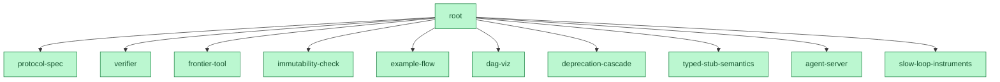

# build2me

**A prove2me-style protocol for building software with swarms of parallel
agents:** an immutable contract DAG, lock-free optimistic coordination,
machine-checkable acceptance per node, cascade verification, and a one-number
scheduler — no task board, no assignments, no human merge bottleneck.

[](https://github.com/shitianfang/build2me/actions/workflows/verify.yml)
**11 / 11 contracts Done · frontier empty · built by a swarm under its own protocol**



<sub>Generated by `node tools/graph.mjs`. Green = the contract's acceptance gate
passed in the verifier's last pass; `root` closed by cascade the moment its last
child did. Regenerate with `node tools/graph.mjs --structural`.</sub>

[Prove2Me](https://arxiv.org/abs/2608.28433) let a swarm of Claude agents
[formalize Fermat's Last Theorem in Lean in 11
days](https://www.anthropic.com/research/formalizing-fermats-last-theorem):
30,300 generated theorems, no human reviewing proofs — trust rested on the
kernel's acceptance of proofs against a small set of immutable, human-audited
statements. Its authors tried the obvious alternatives first — agents
co-editing shared files (they interfere; work can't be partitioned) and git PR
workflows (human merge review becomes the bottleneck) — and built the protocol
because both fail. Those two failure modes are exactly where multi-agent
*software* development stands today.

build2me transplants that protocol to engineering, paying explicitly for the
two places software is harder than mathematics:

1. **Composition is not free.** Children passing their gates doesn't mean the
   parent works, so a parent's acceptance is an integration gate that actually
   runs at cascade time.
2. **Statements change.** Requirements drift; contracts are never edited but
   deprecated, which re-opens dependents — the cascade in reverse.

Read [PROTOCOL.md](PROTOCOL.md) — an agent that has read it can participate
correctly.

## Quickstart

Requires Node >= 20 and git. Zero dependencies.

```sh
git clone https://github.com/shitianfang/build2me
cd build2me

node tools/verify.mjs     # the kernel: statuses, verdicts, gates — must be green on main
node tools/frontier.mjs   # the scheduler: what to work on next, ranked by cascade leverage
```

Try the full lifecycle on the built-in miniature project (a sketched parent
over one Done and one Open child):

```sh
node tools/verify.mjs   --dir acceptance/fixtures/demo
node tools/frontier.mjs --dir acceptance/fixtures/demo
```

Implement the open `mul` contract in a copy of that fixture and watch `calc`
flip to Done by cascade — or just read
[acceptance/example-flow.test.mjs](acceptance/example-flow.test.mjs), which
does exactly that, verified in CI.

## This repository is self-hosting — and closed its own root

build2me was developed under its own protocol, by a swarm: the system is the
`root` contract, decomposed into ten children, and **all eleven contracts are
Done** — `node tools/verify.mjs` reports 11 done / 0 open, and the moment the
last child closed, root's own integration gate ran by cascade and accepted.

Two protocol events from that run are preserved because they are the protocol
working as designed:

- **Race 001** ([races/001-deprecation-cascade.md](races/001-deprecation-cascade.md)):
  three isolated agents raced `deprecation-cascade` against a pre-published
  gate. All passed; a blind pairwise rubric review found a real defect in two
  of three (silent deprecation loss on whitespace names) and the one solution
  that guarded it won. Losing attempts are preserved in full on the
  [`attempts/deprecation-cascade`](https://github.com/shitianfang/build2me/tree/attempts/deprecation-cascade)
  branch — failed work stays searchable.
- **The self-reference lesson**: root's completion gate originally queried the
  accurate frontier — which re-enters the completion gate itself. A completion
  criterion must be structural (the verifier calling it already supplied the
  accurate half). The gate was repaired, the cascade closed root, and the
  lesson lives in `acceptance/root.test.mjs`'s header.

The toolset that came out: `verify` (the kernel), `frontier` (the scheduler),
`graph` (DAG export: json/mermaid/dot), `deprecate` (statement change with
downstream re-open), `stub` (compile-against-stub for typed decomposition),
`serve` (the HTTP coordination server), `misalign` + `drill` (the slow loop).

## Status

v0.1 complete and self-verified — git-native (branches carry attempts; CI is
the verifier). Contributing now means *extending the statement set*: publish a
new contract with a gate (run the gate red-for-the-right-reasons first), or
deprecate-and-supersede one you can improve. This README's claims never outrun
`verify.mjs`.

## License

MIT
