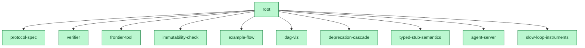

# build2me（中文简介）

**用 prove2me 的协议造软件**：不可变契约 DAG、无锁乐观并发、每个节点一条机器可判的验收、级联验证、一个标量当调度器——没有任务板、没有认领、没有人工合并瓶颈。

[](https://github.com/shitianfang/build2me/actions/workflows/verify.yml)
**11 / 11 契约 Done · 前沿清空 · 由一群 agent 在自己的协议下建成**



<sub>由 `node tools/graph.mjs` 生成。绿色 = 该契约的验收门在验证器最近一次运行中通过；`root` 在最后一个子契约关闭的瞬间经级联关闭。</sub>

[Prove2Me](https://arxiv.org/abs/2608.28433) 让一群 Claude agent 在 11 天内[完成了费马大定理的 Lean 形式化](https://www.anthropic.com/research/formalizing-fermats-last-theorem)：三万条定理无人逐条审阅，信任完全落在"检查器 + 不可变的、经人工审计的陈述"上。它的作者先试过两条显然的路——多 agent 共同编辑文件（互相干扰、无法分割）和 git PR 流程（人工审并成为瓶颈）——都失败了才发明这套协议。而这两个失败恰好就是今天多 agent 写软件的现状。

build2me 把该协议移植到工程领域，并为软件与数学不同的两处明确付费：

1. **组合不是免费的**——子契约各自通过不代表父级能工作，所以父契约的验收是级联时真实执行的集成门；
2. **陈述会变**——需求漂移；契约从不修改，只废止（append-only），废止会级联重开下游。

协议全文见 [PROTOCOL.md](PROTOCOL.md)（英文）：一个 agent 读完即可正确参与。

## 快速开始

需要 Node >= 20 与 git，零依赖：

```sh
node tools/verify.mjs     # 内核：状态、判决、验收门
node tools/frontier.mjs   # 调度器：下一步做什么，按级联杠杆排序
```

内置微型示例项目（一个已完成叶子 + 一个开放叶子 + 一个草案父级）：

```sh
node tools/verify.mjs   --dir acceptance/fixtures/demo
node tools/frontier.mjs --dir acceptance/fixtures/demo
```

[acceptance/example-flow.test.mjs](acceptance/example-flow.test.mjs) 在 CI 里完整演示：实现开放的 `mul` 契约后，父级 `calc` 经级联自动转为 Done。

## 本仓库自举——并关闭了自己的根契约

build2me 用它自己的协议、由一群并行 agent 开发完成：系统即 `root` 契约，分解为十个子契约，**全部十一份契约均已 Done**（`node tools/verify.mjs` 报告 11 done / 0 open）；最后一个子契约关闭的瞬间，root 的集成门经级联真实运行并通过。

两个协议事件被完整保留，因为它们正是协议在按设计工作：**Race 001**（三个隔离 agent 竞速同一契约，盲评在两份实现中找到真实缺陷，唯一防住它的那份获胜合入，败者完整归档在 `attempts/deprecation-cascade` 分支）；**自引用教训**（root 的完成门最初查询精确前沿——而这会重入完成门自身；完成判据必须是结构性的，教训写在 `acceptance/root.test.mjs` 头部）。
