# build2me（中文）

**一句话：在 build 软件之前，先绘制解空间的地图——好让几十个 agent 同时开工，不用互相协调，也不用人来审代码。**

[协议全文](PROTOCOL.md)（英文） · [桩语义](STUBS.md) · [DAG 图](docs/DAG.md) · [Race 001](races/001-deprecation-cascade.md) · [English](README.md)

[](https://github.com/shitianfang/build2me/actions/workflows/verify.yml)
**14 / 14 契约 Done · 前沿清空 · 由一群 agent 在它自己的协议下建成**

```sh
node tools/init.mjs ../my-system --root my-system   # 用它开始你自己的项目
```

---

## 为什么要有这么个东西

让一群 agent 并行写代码，老办法一定死在两个地方：

1. **抢文件。** 几个 agent 同时改同一个文件，merge 变成灾难。
2. **等人审。** PR 得有人看，人就是瓶颈——agent 再快也堵在这里。

[Prove2Me](https://arxiv.org/abs/2608.28433) 给过一个答案。在 Lean 里，编译器说通过就是通过，所以「信任」可以从"人来看"搬到"**不可变的陈述 + 一个机器检查器**"。靠这套协议，一群 Claude agent 在 [11 天里把费马大定理形式化进了 Lean](https://www.anthropic.com/research/formalizing-fermats-last-theorem)——三万多条定理，全程没有人类逐条审阅证明（Kevin Buzzard 是在跑完之后才审的成品）。论文作者先试过两条显而易见的路：多 agent 共同编辑文件（互相干扰），和 git PR 流程（人工审核成瓶颈）。两条都失败了，才有了这套协议。而这两个失败，恰好就是今天多 agent 写软件的现状。

build2me 问的是：**软件里，什么东西能当那个"编译器"？**

答案：**让每条任务自带一条验收命令。**

## 三个对象（整套东西就这三样）

### 1. 契约 contract —— 不可变的「什么必须为真」

一份 JSON 文件，只说**要什么**，对**怎么做**保持沉默。最关键的是 `acceptance` 那一行：

```json
{
  "name": "frontier-tool",
  "title": "前沿查询（调度器）",
  "interface": "CLI: node tools/frontier.mjs [--dir <project>] [--json]。按可关闭度排序打印 Open 的叶子契约。",
  "acceptance": "node --test acceptance/frontier-tool.test.mjs",
  "nl_description": "它取代了任务分配。任何 agent 从这个排名里自取下一件活，没有锁，没有认领。",
  "serves": "root",
  "env": "node>=20"
}
```

**`acceptance` 这一行，就是「做完了」的全部定义。** 没有"差不多可以了"，没有"我再问问"——命令退出码是 0 就是 Done，非 0 就是没做完。

契约**永远不能改**（CI 里的 `check-immutability.sh` 强制只增不改）。但契约**会变——从不修改，只废止；废止会重开下游**。整个演进动作是一条命令：

```sh
node tools/revise.mjs search-index --set interface="..." --reason "位置索引成为必需"
# -> 发布 contracts/search-index-v2.json（前身字段 + 你的改动，自动编号 -v2、-v3……）
# -> 往日志追加 "search-index superseded-by:search-index-v2 ..."
# -> 废止把下游全部打回 Open，frontier 随即列出每个被重开的契约，
#    并直接标出该改指向的后继
```

于是一条陈述可以一轮一轮修订、重拆、逐维度持续优化，而历史只增不改、一行不丢，基于旧契约建过的东西永远可审计。

### 2. 提交 submission —— 对某条契约的一次尝试

放在 `impl/<契约>/<id>/meta.json`。只有两种形态：**要么你直接实现了它，要么你把它拆成几个子契约**。

```json
{ "contract": "calc", "kind": "decomposition", "imports": ["add", "mul"],
  "files": ["src/calc.mjs"], "notes": "calc 基于 add 和 mul 实现" }
```

那个 `imports` 就是 **DAG 的边**。整个项目于是自然长成一棵依赖树。

### 3. 法律 law —— 每个质量维度上的一道「棘轮」

```json
{
  "id": "l5-tool-size",
  "dimension": "complexity",
  "statement": "任何内核工具不得超过 400 行；要么拆开，要么郑重其事地修订这条法律",
  "check": "node laws/checks/l5-tool-size.mjs"
}
```

验证器每跑一遍都会执行每条法律的 `check`，违反就判失败。

> **没有检查脚本的法律不是法律，只是建议。**

用法是「**被咬到了才立法**」：某个页面变慢了，就量出今天的 p95，把这个数字冻成一条法律，从此只能更快、不能更慢。这就是**棘轮**——**绿过的地方，不许再悄悄变红。**

项目需要哪些维度，是**做的过程中发现的**，绝不预先定死。`laws/laws.md` 是给人看的索引。

---

**除了这三样东西，其余一切都不存储。** 状态、判决、工作队列、完成与否——全部由验证器在读取时**推导**出来，不存盘，也没得商量。

| 术语 | 含义 |
|---|---|
| `Open` / `Done` / `Deprecated` | 契约的**推导**状态（不是谁标上去的） |
| `ACCEPTED` | 这份提交的 imports 全部 Done，且契约自己的门跑过了 |
| `SKETCH_ACCEPTED` | 提交本身合法，但还在等未关闭的子契约（"草案先收下"） |
| `GATE_FAILED` | 依赖都齐了，门也跑了，门说不行 |
| **级联 cascade** | 草案的最后一个子契约关闭时，**父契约自己的门**才真正跑起来 |
| **可关闭度 closability** | 关掉这个叶子，能连带自动关掉几个祖先——调度器唯一看的数字 |

## 它是怎么转起来的

内核只有两个工具：

- **`verify.mjs`（内核）** 读完整个项目，跑每条契约自己的验收命令，再用**不动点**推出所有状态。
- **`frontier.mjs`（调度器）** 输出一张按可关闭度排序的表——那就是工作队列。

**没有任务分配，没有认领，没有锁。** agent 自己去前沿挑一条做。于是：

- agent 永远不用等；
- agent 崩了，不阻塞任何人；
- 两个 agent 撞上同一条契约，**是多花钱，不是冲突**——因为契约不可变，任何基于它建起来的东西永远有效，合并时没什么可争的；
- 撞车规则很简单：**先通过的赢。**

**每个 agent 跑的循环就五步：**

```sh
node tools/frontier.mjs          # 1. 挑一条 Open 契约，优先可关闭度高的
                                 # 2. 先搜已有的契约和提交（含失败的）——复用胜过重写
                                 # 3. 实现它，或者把它拆成新的子契约
node tools/verify.mjs            # 4. 本地跑内核，直到全绿
                                 # 5. 提交：分支 + PR，CI 跑的是同一个内核
```

## 这套协议到底图什么

agent 要造的东西大于单个 session 时，真正重要的是三件事：

**1. 一张解空间的地图。** 哪里已经解开——验证过，谁也不能悄悄弄坏；哪里还开着；哪条路试过、失败了、为什么——全留着，下一个 agent 不必再掉同一个坑。这张地图就是仓库本身：`contracts/` 是节点，判决标出已解开的区域，失败的提交和废止记录标出探索过的死路，`node tools/graph.mjs --format json` 把整张图打出来（每个节点的尝试史、放弃原因、每个维度的底线），交给任何工具渲染。

**2. 拆解跟着任务走，从不预先定死。** 开工时你根本不知道正确的拆法是什么、哪些维度需要优化。所以就按今天的理解拆；做着做着学到更好的拆法，就废止重拆，历史全留着。维度也是这样被发现的：一个变慢的页面、一段没人读得懂的模块、一句说了谎的文档。

**3. 每个维度都有一块地基，处处是棘轮。** "能跑"只是其中一个维度，它的地基就是验收门。任务暴露出的其它维度，在咬人的那一刻同样处理：量出今天的水平，冻成法律，从此这块地盘不会无声丢失。进步 = 关闭开放契约 + 有意收紧底线。只进不退。

**一句老实话：** 一个 session 装得下的任务，**直接在那个 session 里做更便宜**。这套东西只在「工作比工人活得久」时才回本——session 会结束，地图留下来。

## 当前的依赖图

```mermaid
graph TD
  agent_server["agent-server"]:::done
  contract_revision["contract-revision"]:::done
  dag_viz["dag-viz"]:::done
  declared_laws["declared-laws"]:::done
  deprecation_cascade["deprecation-cascade"]:::done
  example_flow["example-flow"]:::done
  frontier_tool["frontier-tool"]:::done
  immutability_check["immutability-check"]:::done
  project_init["project-init"]:::done
  protocol_spec["protocol-spec"]:::done
  root["root"]:::done
  slow_loop_instruments["slow-loop-instruments"]:::done
  typed_stub_semantics["typed-stub-semantics"]:::done
  verifier["verifier"]:::done
  contract_revision --> deprecation_cascade
  contract_revision --> frontier_tool
  contract_revision --> verifier
  root --> agent_server
  root -.-> dag_viz
  root --> deprecation_cascade
  root --> example_flow
  root --> frontier_tool
  root --> immutability_check
  root -.-> project_init
  root --> protocol_spec
  root --> slow_loop_instruments
  root --> typed_stub_semantics
  root --> verifier
  classDef done fill:#bbf7d0,stroke:#15803d,color:#14532d
  classDef open fill:#fde68a,stroke:#b45309,color:#78350f
  classDef deprecated fill:#e5e7eb,stroke:#6b7280,color:#374151
```



<sub>由 `node tools/graph.mjs --structural --format mermaid` 逐字生成（与 [docs/DAG.md](docs/DAG.md) 同源，改动后需重新生成）。
绿色 = 该契约的验收门已通过；实线 = 关闭 root 的那份分解（`dec-001`）所 import 的子契约；
虚线 = 只出现在后续分解草案（`dec-002`/`dec-003`）里的子契约——它们本身也已 Done，
只是关闭 root 的不是它们那份分解。`declared-laws` 没有连线：它声明 `serves: root`，
但 root 的三份分解都没有 import 它。`contract-revision` 的三条实线，是它的实现
所依赖（import）的三个内核契约。</sub>

## 快速开始

需要 Node >= 20、git、bash（不可变检查要用），**没有任何 npm 依赖**。

**开始你自己的项目：**

```console
$ git clone https://github.com/shitianfang/build2me
$ cd build2me
$ node tools/init.mjs ../my-system --root my-system
build2me project created at /.../my-system
  root contract: my-system    (14 files written)
```

生成的东西包括：内核工具、一份根契约、一个起始完成门、`laws/`、跑验证器与不可变检查的 CI，还有给将来在那里干活的 agent 读的 `PROTOCOL.md`。

接下来三步：改写根契约说清系统要做什么 → 发布子契约（**每条都带自己的门**）→ 向根提交一份 import 它们的分解。从这一刻起，前沿就是你的待办队列。

**想先看看机制怎么转**，仓库里自带一个微型项目（一个草案父级 `calc`，罩着一个已完成的 `add` 和一个还开着的 `mul`）：

```console
$ node tools/verify.mjs --dir acceptance/fixtures/demo
  add                          DONE
    sub-001                    implementation -> ACCEPTED
  calc                         OPEN
    dec-001                    decomposition -> SKETCH_ACCEPTED
  mul                          OPEN

  1 done, 2 open, 0 deprecated

$ node tools/frontier.mjs --dir acceptance/fixtures/demo
  closability  contract
  1            mul                          Multiplication
```

`mul` 就是全部工作队列，`closability 1` 告诉你：关掉它会连带关掉 `calc`。把 `mul` 实现了，`calc` 的集成门就会经级联自动跑起来——[acceptance/example-flow.test.mjs](acceptance/example-flow.test.mjs) 干的正是这件事，并在 CI 里验证。

## 工具

每个工具都接受 `--dir <project>`，默认当前目录。

| 命令 | 作用 |
|---|---|
| `node tools/init.mjs <dir> [--root <name>] [--force]` | 脚手架一个新项目：内核、根契约、起始门、laws、CI。非空目录会拒绝，除非 `--force`；从不覆盖已有文件。 |
| `node tools/verify.mjs [--json]` | **内核。** 校验结构、拒绝环与自引用、跑验收门、以不动点推出状态与判决。任何结构错误或门失败都非零退出。 |
| `node tools/frontier.mjs [--json]` | **调度器。** 当下可动手的 Open 契约，按可关闭度排序。 |
| `node tools/graph.mjs [--format json\|mermaid\|dot]` | 导出 DAG，节点带状态、边按判决着色。`dot` 需要 graphviz，`mermaid` 可直接在 GitHub 上渲染。 |
| `node tools/stub.mjs <contract> [--format mjs\|dts] [--check]` | 把契约的 interface 物化成可编译的桩，让父级在子契约还不存在时就能加载和类型检查（需要在 interface 里写一个桩围栏块，见 [STUBS.md](STUBS.md)）。`--check` 保证已提交的桩在 CI 里保持诚实。 |
| `node tools/deprecate.mjs <contract> --reason <text>` | 废止一条陈述（只增不改），并列出验证器随之要重新持为 Open 的全部下游。 |
| `node tools/revise.mjs <contract> --set 字段=值 --reason <text>` | **契约演进的方式。** 一步完成"发布后继 + 废止前身"，日志里带 `superseded-by:` 指针；frontier 随即列出每个被重开的下游和该改指向的后继。 |
| `node tools/serve.mjs [--port n]` | HTTP 协调 API：契约、提交、前沿、图，以及**包含失败提交在内**的搜索。无鉴权——见下面的安全须知。 |
| `node tools/misalign.mjs [--since rev] [--json]` | 挖 git 共变历史，报出"契约树说无关、历史说耦合"的文件对。 |
| `node tools/drill.mjs list\|record\|report` | 冷启动 agent 的理解力演练：带预算的题目、只增不改的结果、趋势。 |
| `bash tools/check-immutability.sh <baseline>` | 强制契约与废止日志只增不改。每次 push 和 PR 都在 CI 里跑。 |

## 目录结构

```
contracts/    每条契约一份不可变 JSON——陈述本身
impl/         提交：impl/<契约>/<id>/meta.json + 产物
laws/         laws.md（公理系统）+ deprecations.log（只增不改）
acceptance/   门：每条契约一个测试文件，外加演示用的微型项目
tools/        内核、调度器，以及上面那些仪器
races/        并行尝试的记录：赛前注册的评分表与裁决
drills/       冷启动演练的题目与只增不改的结果
```

## 本仓库自举——并且关闭了自己的根契约

build2me 是用它自己的协议、由一群并行 agent 建成的：系统本身就是 `root` 契约，向下分解；**14 份契约全部 Done**（`node tools/verify.mjs` 报告 14 done / 0 open）。最后一个子契约关闭的那一刻，root 自己的集成门经级联真实跑了一次，并且通过。

这一轮的真实开销（取自 harness 日志）：**七个 Opus agent 会话**——三个竞速同一条契约、一个盲评、三个并行关闭前沿契约——合计约 **62 分钟 agent 墙钟时间**（因为并发，实际耗时远少于此）和 **约 68.3 万 subagent token**，另加一个负责发布契约、审计门、合并的"队长"会话。

有两件事被完整保留下来，因为它们正是协议在按设计工作：

### Race 001——为什么"通过了门"不等于"做对了"

[完整记录在这里](races/001-deprecation-cascade.md)。三个互相隔离的 agent 竞速同一条契约 `deprecation-cascade`，对着一个在他们开工之前就发布好、不可修改的门。

**三份全都通过了门。**

然后，一场**在任何解存在之前就预先注册好**的盲评（两两对照评分表）在其中**两份里找出了真实缺陷**：一个合法的、名字里带空格的契约，会让它们打印成功，却写出一行被引擎读回来时变成另一个名字的日志——于是废止静默失效，**绕过了门自己正在测试的那条"只能废止一次"不变量**。唯一防住这点的那份获胜合入；队长亲手复现了这个缺陷，才接受裁决。落败的两份完整归档在 [`attempts/deprecation-cascade`](https://github.com/shitianfang/build2me/tree/attempts/deprecation-cascade) 分支上。

这件事说明了一条本质局限：

> **内核只判「可不可采纳」，不判「好不好」。** 门是二值的，而二值对门没测到的一切都是瞎的。

所以架构里还有**可选的第二层**：当多份提交都通过同一个门时，用盲评评分表给它们排序。

### 自引用教训

root 的完成门最初去查询"精确的前沿"，而那个查询又会重新进入完成门本身——死循环。结论：**完成判据必须是结构性的**（调用它的验证器已经提供了精确的那一半）。记录在 [acceptance/root.test.mjs](acceptance/root.test.mjs) 的文件头。

两件事给出同一条规则，现已写进协议：

> **一个门在发布之前，必须先因为正确的理由跑红一次。**
> 没人能满足的陈述，是陈述本身的缺陷。

`project-init` 的门就抓到过自己：工具还不存在时它却通过了，只因为一条崩溃信息恰好匹配了断言。

## 一个带数字的对照实验

`examples/ranked-search/` 是一个排序全文搜索 CLI，分三轮建成，**每轮都换一个对前情零记忆的全新 agent**，全程在协议下：先建成，再注入一次中途需求变更（加精确短语查询——三份契约被废止并发布后继、依赖重新指向），最后一轮只许优化、不许倒退。每轮由赛前注册的隐藏评审打分；同一个任务同时由**不用协议**的普通 agent session 平行做一遍，同模型、同 prompt。

| 轮次 | 质量（词项 / 短语 P@10） | 索引体积比 | p95 |
|---|---|---|---|
| 建成 | 0.83 / — | 0.2525 | 101 ms |
| 加短语 | 0.83 / 0.78（上限 .80） | 0.3036 | 109 ms |
| 优化 | 0.83 / 0.78 | **0.2136** | 98 ms |

守住的地盘一寸未丢（任何一轮、任何指标零倒退），底线带着收据移动（体积法律 0.32 → 0.38 为位置索引付费，→ 0.26 编码优化后收紧），全程 token 是普通臂的 **1.15 倍**——完整数字（**包括普通臂更好的地方**）见 [bench/002-ranked-search/results.md](bench/002-ranked-search/results.md)。

## 人类还做什么

三件事，仅此三件：

1. **审顶层契约的忠实性**——这条陈述真的是我们想要的东西吗？用 Prove2Me 的盲读回译法：让一个 agent 在看不到原始意图的情况下复述契约，再对比。
2. **修订法律**——这是对"品味"的、刻意的、带版本的编码。
3. **在门判不了的时候，仲裁维度之间的取舍。**

**人类不再为正确性审查实现**——那是门的工作。git 原生流程里仍然由人按下合并键（除非你开了绿灯自动合并），被去掉的是"读 diff 来判断它到底行不行"这件事。

## 安全须知

**验证器会把每份契约的 `acceptance` 字符串当 shell 命令执行。** 这是设计使然（门必须能跑构建能跑的一切），但意味着：

- **一个新增契约的 PR，等于一个往你 CI 里注入任意代码的 PR。** 把"发布契约"当成它本来就是的特权操作：像审 workflow 文件那样审它；仓库公开的话，关掉 fork PR 的 CI，或要求人工批准。
- `tools/serve.mjs` 无鉴权、无配额，而且会写项目目录。只绑本机或可信网络。账户与鉴权是明确延后的。
- **这里没有任何沙箱。** 要跑不可信的 agent，请自己隔离进程。

## 已知边界

- **横切文件。** 契约级的文件归属只是约定，不是强制：两个 agent 关闭不同契约，仍可能都要改同一份共享清单或公共模块。v0.1 是事后检测（`misalign.mjs` 报的正是这种形状），不是事前预防。
- **门写多好，保障就多好。** Race 001 就是证据：三份实现通过同一个门，其中两份带真实缺陷。可采纳性是机械的，质量仍然需要选择层或者人。
- **判决只裁契约，不归功劳。** 门是按契约、对着工作树跑的，所以同一条契约有多份提交就绪时，决定谁显示 ACCEPTED 的是**目录顺序**而不是因果——一份把别人产物写进 `files` 的提交可以冒领。把判决绑定到提交声明的产物，是待做项。
- **契约不可变，但门可变。** CI 保护 `contracts/` 和废止日志，**尚无机制保护 `acceptance/`**——后来的 commit 可以在不触发任何检查的情况下把一个门改弱。计划中的修法：CI 强制"门必须早于该契约的第一份提交"。
- **Done 的根与开放的 backlog 不能共存。** 根门断言前沿为空，所以发布任何新的开放契约都会重开 root、令 main 变红，直到新契约关闭。这正是 prove2me 的 mission 语义（完成即无开放项）。新工作要么当轮就关闭，要么开一个新的根。
- **重复尝试要花真金白银。** "先通过者胜"意味着一条被争抢的契约可能被付费 N 次。Race 001 丢弃了三分之二的实现——在那里值得（被丢弃的那两份暴露了一个缺陷和一处门的笔误），但这是逐条契约的选择，不是免费午餐。

## 与 Prove2Me 的关系

这套协议是对 [Prove2Me](https://arxiv.org/abs/2608.28433)（Shuze Chen、Kunal Marwaha、Xiaoyang Lu、Henry Yuen、Tianyi Peng）的一次刻意移植。

**原样保留的**：不可变陈述、证明草案式分解、无锁乐观并发（agent 自由取活，无锁无分配）、可搜索的失败尝试（在 FLT 那次运行里，从失败里捞回来的代码占最终非样板行数的约 7%）、以及一个小而经人工审计的核心。

**build2me 自己的两个调度选择**（不是论文的）：Prove2Me 用人工策划的里程碑和一个搜索 API 来引导 agent，build2me 则用一个"可关闭度"标量给前沿排序；论文没有规定竞速的仲裁规则，build2me 规定先通过者胜。

**软件逼出的两处改造**，数学不需要：

| | Prove2Me（数学） | build2me（软件） |
|---|---|---|
| 组合 | **免费**——Curry–Howard 保证"基于已证引理的证明"仍是证明 | **不免费**——父级的验收是一道在级联时真实执行的集成门 |
| 陈述 | 永远不会变假 | **会变**——契约从不修改，只废止；废止会重开下游（一条命令：`tools/revise.mjs`） |

## 当前状态

v0.1，已完成、已自验证。git 原生：分支承载尝试，CI 即内核。

**明确延后、并已如实声明**的部分：`tools/serve.mjs` 的异步验证队列与判决轮询、账户与鉴权、每账户在途上限、多项目路由。收紧其中任何一条，都必须走"废止 + 发布后继契约"，不能改契约。

## 怎么参与

`node tools/frontier.mjs` 就是贡献指南。前沿现在是空的，所以参与意味着**扩展陈述集**：发布一条新契约连同它的门（记得先让门因为正确的理由跑红一次），或者修订一条你能改进的（`node tools/revise.mjs`，一步完成废止 + 后继）。

先读 [PROTOCOL.md](PROTOCOL.md)（英文）——一个读完它的 agent 就能正确参与。

## 许可

MIT，见 [LICENSE](LICENSE)。
