# build2me（中文简介）

**用 prove2me 的协议造软件**：不可变契约 DAG、无锁乐观并发、每个节点一条机器可判的验收、级联验证、一个标量当调度器——没有任务板、没有认领、没有人工合并瓶颈。

[](https://github.com/shitianfang/build2me/actions/workflows/verify.yml)
**12 / 12 契约 Done · 前沿清空 · 由一群 agent 在自己的协议下建成**

```mermaid
graph TD
  root["root"]:::done
  protocol_spec["protocol-spec"]:::done
  verifier["verifier"]:::done
  frontier_tool["frontier-tool"]:::done
  immutability_check["immutability-check"]:::done
  example_flow["example-flow"]:::done
  dag_viz["dag-viz"]:::done
  deprecation_cascade["deprecation-cascade"]:::done
  typed_stub_semantics["typed-stub-semantics"]:::done
  agent_server["agent-server"]:::done
  slow_loop_instruments["slow-loop-instruments"]:::done
  project_init["project-init"]:::done
  root --> protocol_spec
  root --> verifier
  root --> frontier_tool
  root --> immutability_check
  root --> example_flow
  root --> dag_viz
  root --> deprecation_cascade
  root --> typed_stub_semantics
  root --> agent_server
  root --> slow_loop_instruments
  root --> project_init
  classDef done fill:#bbf7d0,stroke:#15803d,color:#14532d
```



<sub>由 `node tools/graph.mjs` 生成。绿色 = 该契约的验收门在验证器最近一次运行中通过；`root` 在最后一个子契约关闭的瞬间经级联关闭。</sub>

[Prove2Me](https://arxiv.org/abs/2608.28433) 让一群 Claude agent 在 11 天内[完成了费马大定理的 Lean 形式化](https://www.anthropic.com/research/formalizing-fermats-last-theorem)：三万条定理无人逐条审阅，信任完全落在"检查器 + 不可变的、经人工审计的陈述"上。它的作者先试过两条显然的路——多 agent 共同编辑文件（互相干扰、无法分割）和 git PR 流程（人工审并成为瓶颈）——都失败了才发明这套协议。而这两个失败恰好就是今天多 agent 写软件的现状。

build2me 把该协议移植到工程领域，并为软件与数学不同的两处明确付费：

1. **组合不是免费的**——子契约各自通过不代表父级能工作，所以父契约的验收是级联时真实执行的集成门；
2. **陈述会变**——需求漂移；契约从不修改，只废止（append-only），废止会级联重开下游。

协议全文见 [PROTOCOL.md](PROTOCOL.md)（英文）：一个 agent 读完即可正确参与。

## 快速开始

需要 Node >= 20、git、bash（不可变检查用），无 npm 依赖。

**用它开始你自己的项目**：

```sh
node tools/init.mjs ../my-system --root my-system
```

会生成：内核工具、一份根契约、一个结构性的完成门、`laws/`、跑验证器与不可变检查的 CI，以及给 agent 读的 `PROTOCOL.md`。随后改写根契约说清系统要做什么，发布子契约（**每个都带自己的门**），再向根提交一份 import 它们的分解——从此前沿就是你的待办队列。

**先看机制**（内置微型项目：草案父级 `calc` + 已完成 `add` + 开放 `mul`）：

```sh
node tools/verify.mjs   --dir acceptance/fixtures/demo
node tools/frontier.mjs --dir acceptance/fixtures/demo
```

[acceptance/example-flow.test.mjs](acceptance/example-flow.test.mjs) 在 CI 里完整演示：实现开放的 `mul` 后，父级 `calc` 经级联自动转为 Done。

## 安全须知

验证器会把每份契约的 `acceptance` 当 shell 命令执行——这是设计使然（门必须能跑构建能跑的一切），但意味着：**新增契约的 PR 等于向你的 CI 注入任意代码**，公开仓库请关闭 fork PR 的 CI 或要求审批；`tools/serve.mjs` 无鉴权、无配额且会写项目目录，仅限本机或可信网络；这里没有沙箱，运行不可信 agent 请自行隔离进程。

## 已知边界

- **横切文件**：契约级的文件归属是约定而非强制，两个 agent 关闭不同契约仍可能都要改共享清单或公共模块。v0.1 是事后检测（`misalign.mjs` 报的正是这种形状），不是事前预防。
- **门的质量决定一切**：Race 001 证明了这点——三份实现通过同一个门，其中两份带真实缺陷。可采纳性是机械的，质量仍需选择层或人。
- **重复尝试要真金白银**：首个通过者胜意味着同一契约可能付 N 次钱。Race 001 丢弃了三分之二的实现——在那里值得（被丢弃的那两份暴露了缺陷和门的错误），但这是逐契约的选择，不是免费午餐。

## 本仓库自举——并关闭了自己的根契约

build2me 用它自己的协议、由一群并行 agent 开发完成：系统即 `root` 契约，分解为十一个子契约，**全部十二份契约均已 Done**（`node tools/verify.mjs` 报告 12 done / 0 open）；最后一个子契约关闭的瞬间，root 的集成门经级联真实运行并通过。

这一轮的真实开销（取自 harness 日志）：**七个 Opus agent 会话**——三个竞速同一契约、一个盲评、三个并行关闭前沿契约——合计约 **62 分钟 agent 墙钟**（并发运行，实际耗时远少于此）与 **约 68.3 万 subagent token**，另加发布契约、审计门、合并的队长会话。

两个协议事件被完整保留，因为它们正是协议在按设计工作：

- **Race 001**（[完整记录](races/001-deprecation-cascade.md)）——三个隔离 agent 竞速同一契约，对着赛前发布、不可修改的门。三份全部通过；随后一场**在任何解存在之前就预注册**的成对盲评在其中两份里找到真实缺陷：合法的含空格契约名会让它们打印成功，却写出引擎读回成另一个名字的日志行，废弃静默失效，并绕过门自己测试的"只能废弃一次"不变量。唯一防住它的那份获胜合入，队长亲手复现缺陷后才接受裁决；败者完整归档在 [`attempts/deprecation-cascade`](https://github.com/shitianfang/build2me/tree/attempts/deprecation-cascade) 分支。
- **自引用教训**——root 的完成门最初查询精确前沿，而这会重入完成门自身。完成判据必须是结构性的（调用它的验证器已经提供了精确的那一半）。记录在 [acceptance/root.test.mjs](acceptance/root.test.mjs) 头部。

两者给出同一条规则，现已写进协议：**门在发布前必须因正确的理由跑红一次**。没人能满足的陈述是陈述本身的缺陷。

## 人类还做什么

三件事，仅此三件：审计顶层契约的忠实性（用盲读回译对照）、修订 laws（对品味的刻意的、带版本的编码）、在门判不了时仲裁维度取舍。人类不为正确性审查实现——那是门的工作；git 原生流程里仍由人按下合并键（除非开启绿灯自动合并），被去掉的是"读 diff 判断它行不行"。

## 完整协议

见 [PROTOCOL.md](PROTOCOL.md)（英文）与 [README.md](README.md)：对象定义、判决与状态、级联、分解、协调、前沿与 closability、废止、laws、人类职责、agent 操作手册。
