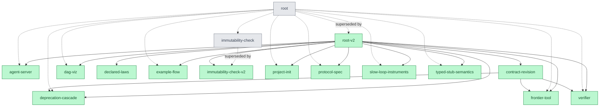

# The DAG, rendered

Generated by `node tools/graph.mjs` (14 done / 0 open / 2 deprecated — the two
grey nodes are predecessors revised live, each with its `superseded by` edge).
GitHub renders this natively; regenerate after any change.

For the interactive page with the Race 001 panel, open [docs/atlas.html](atlas.html).
