# The DAG, rendered

Generated by `node tools/graph.mjs` (13 done / 0 open). GitHub renders this
natively; regenerate after any change.

```mermaid
graph TD
  agent_server["agent-server"]:::done
  dag_viz["dag-viz"]:::done
  declared_laws["declared-laws"]:::done
  deprecation_cascade["deprecation-cascade"]:::done
  example_flow["example-flow"]:::done
  frontier_tool["frontier-tool"]:::done
  immutability_check["immutability-check"]:::done
  project_init["project-init"]:::done
  protocol_spec["protocol-spec"]:::done
  root["root"]:::done
  slow_loop_instruments["slow-loop-instruments"]:::done
  typed_stub_semantics["typed-stub-semantics"]:::done
  verifier["verifier"]:::done
  root --> agent_server
  root -.-> dag_viz
  root --> deprecation_cascade
  root --> example_flow
  root --> frontier_tool
  root --> immutability_check
  root -.-> project_init
  root --> protocol_spec
  root --> slow_loop_instruments
  root --> typed_stub_semantics
  root --> verifier
  classDef done fill:#bbf7d0,stroke:#15803d,color:#14532d
  classDef open fill:#fde68a,stroke:#b45309,color:#78350f
  classDef deprecated fill:#e5e7eb,stroke:#6b7280,color:#374151
```

For the interactive page with the Race 001 panel, open [docs/atlas.html](atlas.html).
